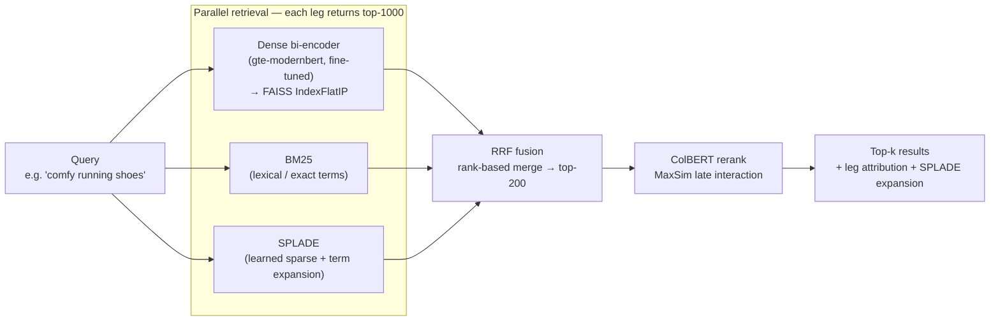
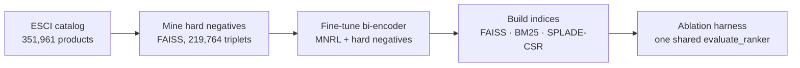

# DANTE — Multi-Stage Hybrid Product Search Engine

DANTE is a production-shaped **hybrid retrieval + reranking** search engine over the Amazon
ESCI shopping-queries catalog (**351,961 products**). It runs three complementary retrievers
in parallel — a **fine-tuned dense bi-encoder**, **BM25** lexical, and **SPLADE** learned-sparse —
fuses them with **Reciprocal Rank Fusion (RRF)**, and reranks the survivors with a **ColBERT
late-interaction** model. Every configuration is measured through one shared eval harness on a
query-disjoint test split, so each stage's contribution is provable, not asserted.

**Headline (v0.2, hard-negative fine-tune):** the dense leg went from **R@200 0.627 → 0.698
(+11%)** and **nDCG@10 0.313 → 0.410** after hard-negative mining on a retrieval-pretrained
backbone; the best serving config (**Dense+SPLADE, RRF k=30**) reaches **R@200 0.729 /
nDCG@10 0.448 / MRR@10 0.682**. A controlled A/B showed the *same* hard negatives **regressed**
a raw-MLM backbone to 0.548 — the central engineering finding below.

> **Status.** Development and evaluation ran on Modal A100s between 2026-06-28 (v0.1) and
> 2026-07-07 (v0.2.0 tagged). The Modal deployment was **decommissioned 2026-07-09**; trained
> weights and indices are archived offline, and every pipeline stage rebuilds its artifact from
> the public dataset — see [Artifacts & archival status](#artifacts--archival-status).

---

## Why hybrid retrieval — and why ESCI is a hard testbed

### Three retrievers, three failure modes

No single retrieval paradigm covers product search on its own, because each one fails in a
different, *predictable* way:

- **Lexical (BM25)** matches the exact tokens you typed. It nails brand names, model numbers,
  and SKUs ("Nike Air Max 90") — but it has zero notion of meaning, so "comfy running shoes"
  finds nothing whose title doesn't literally say "comfy". In our v0.1 ablation BM25 posted a
  respectable MRR@10 (0.542, *above* the dense leg's 0.531) on the head of the ranking, yet the
  **worst deep recall of all three legs** (R@200 0.530): once the exact words run out, it has
  nothing left to offer.
- **Dense (bi-encoder)** matches meaning: it embeds query and product into one vector space, so
  "running shoes" ≈ "athletic sneakers". Its failure mode is the inverse — single-vector
  semantic blur loses the token-precise details (an exact model number is just another word in
  the soup), and an off-the-shelf or weakly trained encoder ranks confusable-but-wrong products
  highly. v0.1's in-batch-trained dense leg had good *depth* (R@200 0.627, best of the single
  legs at that time bar SPLADE) but poor *ordering* (nDCG@10 0.313, barely above BM25).
- **Learned-sparse (SPLADE)** sits between the two: an MLM head projects text onto a ~30K-term
  vocabulary with learned weights, *including expansion terms not in the surface text* —
  "running" also lights up "jog / sprint / athletic". It keeps lexical precision while buying
  back semantic coverage, and it was the strongest single leg in every ablation we ran (R@200
  0.674, nDCG@10 0.434).

Because the failure modes are complementary, **rank-based fusion of the legs beats any single
leg**: Dense+SPLADE reaches R@200 0.730 vs 0.674 for the best single retriever. That is the
project's thesis, and the ablation table below is its proof. The reranker then addresses what
fusion cannot: fusion widens the *net*, ColBERT perfects the *order* of what was caught.

### What makes ESCI specifically hard

The Amazon ESCI (Shopping Queries) dataset is real e-commerce search, and it stresses exactly
the seams between those paradigms:

1. **Graded, sparse labels.** Each judged query-product pair carries one of four human grades —
   `Exact / Substitute / Complement / Irrelevant` — but only a **handful of products per query
   are judged at all** (43,151 judgements across 2,150 test queries ≈ ~20 per query, against a
   351,961-product catalog). Any product outside that labeled set is *unknown*, not *wrong*.
   This poisons naive hard-negative mining (a top-ranked "negative" is very often an unlabeled
   relevant — the root of the v0.2 backbone finding below) and it deflates recall metrics:
   R@10 sits at ~0.2–0.28 for every config simply because most queries have more graded-relevant
   products than fit in ten slots.
2. **Keyword-dense product titles.** Amazon product text packs brand, model, attributes, and
   marketing terms into the title (`title [SEP] brand [SEP] bullets [SEP] description` is what
   we index). That plays to BM25's strengths on head queries — which is precisely why its
   MRR@10 stays competitive — while making semantic ordering harder for a dense model that sees
   near-duplicate keyword soups for confusable products.
3. **Relevance-only signal.** ESCI carries no ratings, sales, or click data — just the human
   E/S/C/I grade. There is no behavioral prior to lean on, so retrieval quality has to come
   entirely from the text and the labels. (A real store would blend behavioral signals into the
   final ranking; see Limitations.)
4. **Ambiguous middle grades.** `Complement` (related accessory, not what was asked for — 2.89%
   of labels) is genuinely ambiguous for contrastive training, so we exclude it from training
   pairs entirely and count only `Exact`+`Substitute` (grade ≥ 2) as recall-relevant, while nDCG
   still uses the full graded map.

---

## Architecture



**Offline training / index pipeline** (feeds the dense leg above):



### Stage by stage

**1. Dense bi-encoder (fine-tuned).** A single-vector encoder maps the query and each product
into the same 768-d space; cosine similarity is relevance. Products are embedded once into a
`faiss.IndexFlatIP` (L2-normalized → inner product = cosine); at query time one encode + one
ANN search returns the top-1000. This leg captures *semantic* matches ("comfy" ≈ "cushioned")
that lexical search misses. It is the only trained component and the focus of v0.2 (below).

**2. BM25 (lexical).** Classic TF-IDF-style term scoring over tokenized product text. It nails
the things dense embeddings blur — exact brand names, model numbers, SKUs, rare tokens. Pure
`rank_bm25`, no training. Cheap to build, and a strong, hard-to-beat baseline on head queries.

**3. SPLADE (learned sparse).** An MLM (`opensearch-neural-sparse-encoding-v2-distill`, Apache-2.0)
projects text onto a ~30K-term vocabulary with learned weights, *including expansion terms not in
the surface text* ("running" also lights up "jog / sprint / athletic"). Stored as a `scipy.sparse`
CSR matrix; search is one sparse matmul. It bridges lexical and semantic — the strongest single
leg in every ablation.

**4. RRF fusion.** The three legs' scores live on incomparable scales (BM25 ∈ [0,30], cosine ∈
[0,1], SPLADE dot ∈ [0,40]), so fusion ignores raw scores and uses only **rank position**:
`RRF(d) = Σ_legs 1/(k + rank_leg(d))`. A product ranked highly by several legs accumulates a high
fused score even if no single leg put it first. Keep the top-200 as the rerank shortlist. `k` is a
tunable knob — swept below.

**5. ColBERT rerank.** A late-interaction model (`answerai-colbert-small-v1`) that keeps a vector
*per token* and scores `MaxSim(Q,D) = Σ_i max_j (q_i · d_j)` — each query token finds its best
matching document token. This is cross-encoder-quality (tokens interact) at bi-encoder-ish cost
(documents are pre-encodable). It runs on the 200 fused candidates only — reranking the full
catalog would be intractable, which is exactly why the fast legs narrow first. It **reorders**,
so it lifts ranking metrics (nDCG/MRR) while recall is unchanged.

---

## Component deep-dives

### Dense bi-encoder — the trained leg

**Backbone.** v0.1 fine-tuned `answerdotai/ModernBERT-base` (150M params, raw MLM pretraining).
For v0.2 a model-research pass (2026-07-06, every candidate curl-verified for HF gating, license,
and compatibility with the pinned `transformers 4.57.6 / sentence-transformers 4.1.0` stack)
selected **`Alibaba-NLP/gte-modernbert-base`**: Apache-2.0, ungated, and the *same* ModernBERT
architecture — so it drops in via a `--base-model` flag with **zero code change** — but
**retrieval-pretrained** (BEIR 55.33) instead of MLM-only. That last property turned out to be
decisive (see the engineering journey). `BAAI/bge-base-en-v1.5` was considered and dropped from
the retrain roster: it needs instruction-prefix plumbing on the query side to be evaluated
fairly, and running two *prefix-free* backbones (gte-modernbert vs raw ModernBERT) kept the
backbone A/B clean. `Qwen3-Embedding-0.6B` is held in reserve as a high-ceiling ablation.

**Training recipe (v0.2 winner).** `MultipleNegativesRankingLoss` (MNRL) over mined triplets:
- **Data:** 219,764 `(anchor, positive, negative)` triplet rows (see mining below); MNRL in
  ST 4.x natively treats every column after `(anchor, positive)` as an explicit hard negative
  on top of the in-batch ones.
- **Batching:** `bs=128`, 3 epochs ≈ **5,151 optimizer steps**, lr `2e-5`, cosine schedule with
  `warmup_ratio=0.1`, bf16, `max_seq_length=256`, mean pooling, `attn_implementation="sdpa"`
  (avoids the optional flash-attn build).
- **`BatchSamplers.NO_DUPLICATES`** — load-bearing with triplet data: the same `(anchor,
  positive)` repeats once per mined negative, and if two such rows land in one batch, MNRL
  treats one row's positive as another row's in-batch negative and pushes an anchor away from
  its *own* positive. NO_DUPLICATES guarantees no repeated text within a batch.
- **In-loop eval:** an `InformationRetrievalEvaluator` over a query-disjoint val holdout (capped
  at 2,000 pairs; corpus = the val positives as a cheap proxy catalog) surfaces nDCG@10 /
  accuracy@1,10 / MAP@10 during training to catch hard-negative overfit early; best-checkpoint
  selection uses `eval_loss` (always present → robust). Eval/save cadence is **adaptive** —
  every `max(25, total_steps // 15)` steps, i.e. ~15 evals per run regardless of batch size — a
  fixed `eval_steps=25` would have meant ~200 in-loop IR evals at bs=128 (~1h of pure eval
  overhead). Checkpoints keep `save_total_limit=2`; each `--output-name` gets its own checkpoint
  dir so runs never mix. Runs log to W&B (project `dante-portfolio`).

**Hard-negative mining (`--stage mine`).** `sentence_transformers.util.mine_hard_negatives`
with `use_faiss=True` — one batched ANN pass of all training anchors against the **full
351,961-product catalog**, never the O(Q×N) per-query loop. Parameters: `num_negatives=4`,
`range_min=10` / `range_max=200` (mine from ranks 10–200), `sampling_strategy="random"` within
the range for diversity, `relative_margin=0.05`, `output_format="triplet"`, encode
`batch_size=1024` on the A100. The kwargs are built defensively against the runtime
`mine_hard_negatives` signature (ST renames `margin` → `absolute_margin`/`relative_margin`
across versions), and a small runtime shim patches `datasets>=4`'s lazy `Column` type with a
`.copy()` (ST 4.1 expects the old list return) — surgical, no downgrade.

**Serving.** Products are encoded once and stored in a `faiss.IndexFlatIP`; both document and
query embeddings are explicitly L2-normalized (inner product = cosine), with a unit-norm assert
before indexing — an un-normalized `IndexFlatIP` returns plausible-but-wrong rankings, the worst
kind of bug.

### BM25 — the lexical baseline

A thin wrapper over `rank_bm25.BM25Okapi`. Tokenization is a lowercase whitespace split, applied
identically on the document and query sides so the leg stays symmetric with its own index.
Top-k selection uses `np.argpartition` then sorts only the k survivors. The index pickles to
`(bm25, doc_ids)`. Zero training, minutes to build — and, being pure Python, it is the
**wall-clock bottleneck** of any full-catalog evaluation, which is what motivated the ablation
harness's per-query leg cache (below).

### SPLADE — learned sparse (and the license story)

Encoding is the standard SPLADE aggregation: MLM logits → `log1p(relu(logits))`, masked by
attention, `max` over the sequence dimension → one sparse vector over the WordPiece vocabulary.
Each non-zero entry is a term with a learned weight, including expansion terms that never appear
in the input — the repo ships a `visualize_expansion` helper (also used in the demo and as a
preflight sanity check) that shows exactly which terms a query lit up.

The checkpoint itself was replaced **twice**, both times for supply-chain rather than quality
reasons:

1. The plan's `naver/splade-v3` turned out to be **gated** on HF (401, requires approval) — a
   clone-and-run repo can't depend on it. → swapped to the ungated
   `naver/splade-cocondenser-ensembledistil` (validated in the 2026-06-28 full run).
2. The finish-day license audit (2026-07-06) found cocondenser-ensembledistil is
   **CC-BY-NC-SA — non-commercial** — unusable for a commercial-friendly portfolio. → replaced
   with **`opensearch-project/opensearch-neural-sparse-encoding-v2-distill`**: Apache-2.0,
   ungated, BEIR avg nDCG@10 ~0.528, and architecturally a standard `DistilBertForMaskedLM`, so
   it loads via `AutoModelForMaskedLM` and the aggregation code applies **unchanged** (verified
   against its config.json). `prithivida/Splade_PP_en_v1` was noted as the fallback.

The catalog index stores all document vectors as **one `scipy.sparse` CSR matrix**
(`[num_docs × vocab_size]`, persisted as `.npz` + a sidecar id list); a query is scored with a
single sparse matmul `q @ doc_matrix.T` — vectorized, never a per-doc Python loop. A real
production deployment would use an inverted impact-sorted index (e.g. Anserini); the CSR matmul
is the honest, fast-enough eval/demo path.

### RRF fusion — plain and weighted

`reciprocal_rank_fusion` implements `RRF(d) = Σ_r w_r / (k + rank_r(d))`. The optional
`weights` parameter (parallel to the ranked lists; `None` = classic uniform RRF) exists because
of a v0.2 measurement: adding BM25 as a third leg at full weight slightly *hurt* the best
two-leg config, but down-weighting BM25's vote to **0.5** (`weights=[1.0, 0.5, 1.0]` for
dense/bm25/splade) recovered most of the loss — keeping the lexical signal without letting its
noise swamp the fusion. The constant `k` damps how much rank differences matter (higher k →
flatter votes, favoring deep consensus; lower k → sharper top-rank emphasis); the sweep below
found **k=10–30 beats the k=60 default on nDCG@10 at essentially equal R@200**, in both v0.1
and v0.2.

### ColBERT — the late-interaction reranker

`answerdotai/answerai-colbert-small-v1` (33M params), loaded through AnswerDotAI's `rerankers`
library — purpose-built for this checkpoint and dependency-light, chosen after pylate (which
couples to sentence-transformers internals) broke on the newer stack. Unlike the bi-encoder's
one-vector-per-text, ColBERT keeps a vector per *token* and scores
`MaxSim(Q,D) = Σ_i max_j (q_i · d_j)`: each query token finds its best-matching document token
and the maxima are summed. Tokens interact at scoring time (cross-encoder-like quality) but
documents are pre-encodable (bi-encoder-like cost) — the right trade for reranking a 200-item
shortlist.

Two implementation contracts worth noting:

- **Never-crash / identity fallback.** Any reranker failure — import error, model-load failure,
  scoring exception — logs a warning and returns the candidates in their incoming (fused) order.
  A broken reranker row therefore degrades to the fusion numbers instead of killing a multi-hour
  ablation. Models are cached per process, keyed by `(model_name, model_type)`.
- **A generic `rerank(...)`** serves cross-encoder models through the same library and the same
  contract, which is how the ablation compared late-interaction vs cross-encoder rerankers over
  *identical* fused candidates.

---

## Results

Amazon ESCI (US, reduced), query-disjoint split (leakage asserted = 0). Graded qrels
(Exact=3 / Substitute=2 / Complement=1 / Irrelevant=0); recall counts Exact+Substitute as
relevant. v0.1 evaluated on a 2,000-query sample, v0.2 on an 800-query sample — the two are
directly comparable because the **model-independent** rows match across samples (BM25 R@200
0.530→0.517, SPLADE 0.674→0.677). Retriever ceiling (canonical-query self-hit on the full index)
= **rank-1 0.993 / rank-10 0.9995** → the encoder + index are correct, so the numbers are trustworthy.

| Configuration | R@200 (v0.1) | R@200 (v0.2) | nDCG@10 (v0.1) | nDCG@10 (v0.2) |
|---|---|---|---|---|
| BM25 | 0.530 | 0.517 | 0.321 | 0.317 |
| Dense | 0.627 | **0.698** | 0.313 | **0.410** |
| SPLADE | 0.674 | 0.677 | 0.434 | 0.432 |
| Dense + BM25 (RRF) | 0.678 | 0.692 | 0.363 | 0.393 |
| Dense + SPLADE (RRF) | 0.730 | **0.730** | 0.418 | **0.446** |
| Dense + BM25 + SPLADE (RRF) | 0.719 | 0.715 | 0.424 | 0.428 |
| ↑ + ColBERT rerank | 0.719 | 0.715 | **0.448** | 0.446 |
| ↑ + CE rerank (gte-modernbert) | — | 0.715 | — | 0.330 |
| **Dense + SPLADE (RRF k=30)** | — | **0.729** | — | **0.448** |
| Dense + BM25 + SPLADE (weighted RRF) | — | 0.728 | — | 0.445 |

**How to read the numbers.** **R@200** is the recall of the 200-candidate set the reranker
actually sees — the ceiling on final quality, since the reranker can only reorder what fusion
hands it. **nDCG@10** is top-10 ranking quality (are the best answers near the top, in order).
R@10 is low across the board (~0.2–0.28) because each query has many graded-relevant products;
R@200 is the meaningful recall headline.

**What it shows.** (1) **Fusion lifts recall**: best R@200 0.730 (Dense+SPLADE) vs 0.674 for the
best single leg. (2) **The hard-negative fine-tune lifts the weakest leg by a wide margin**:
dense R@200 +11%, nDCG@10 +0.097. (3) **A stronger dense leg does not fold into free fused
recall**: Dense+SPLADE R@200 is flat (0.730→0.730) because SPLADE already covered what the old
dense leg missed — but the *ranking* of that same config improves markedly (nDCG@10 0.418→0.446).
(4) **ColBERT lifts ranking, not recall** (it only reorders the top-200). (5) **RRF k=30 beats the
k=60 default** on ranking at equal recall — measured in both versions.

Full numbers: [`ablation_results.json`](ablation_results.json) (v0.1) and [`eval_enrich.json`](eval_enrich.json)
(dim-truncation + RRF-k sweeps).

---

## Evaluation methodology

Every number in this README came through **one** code path, and the harness design is half of
what the project demonstrates.

### One `evaluate_ranker`, one interface

Every configuration — a single leg, a fusion, a reranked pipeline — is expressed as a
`rank_fn: query_text → ranked product_ids` and evaluated by the same `evaluate_ranker`
(`dante/eval/evaluate.py`). No config can accidentally use a different nDCG definition, a
different qrels file, or a different query sample. The ablation is literally a dict of
`{name: rank_fn}` looped through one function.

### Metrics, exactly as implemented

- **Recall@k** — binary relevance at **grade ≥ 2** (Exact + Substitute): fraction of a query's
  relevant products found in the top-k. `Complement` and `Irrelevant` never count as relevant.
- **nDCG@10** — uses the **full graded map** (Exact=3, Substitute=2, Complement=1,
  Irrelevant=0): `DCG = Σ grade(rank_i)/log2(i+1)` over the top 10, normalized by the ideal DCG
  from the sorted grade list. Unjudged products score 0.
- **MRR@10** — reciprocal rank of the *first* grade ≥ 2 hit within the top 10; 0 if none.
- **Skip-if-no-positive rule** — a query with no grade ≥ 2 judgement has undefined recall/MRR,
  so it is skipped (not scored as 0) and metrics are averaged only over queries where they are
  defined. The subsampler applies the same eligibility filter, so every config sees the same
  denominator.

The metric implementations have hand-computed unit tests (`dante/tests/test_metrics.py`),
including an exact-value nDCG case.

### The fixed eval sample

The test split holds 2,150 queries; the ablation evaluates a deterministic subsample —
eligible queries are **sorted, then sampled with `random.Random(seed=42)`** — capped at
`max_queries=2000` (v0.1). The v0.2 winner-selection sweeps used an 800-query cap: ~2.5× faster
(the pure-Python BM25 leg dominates wall-clock) and R@200-stable, and validly comparable to
v0.1 because the model-independent BM25/SPLADE rows reproduced across the two samples. The
eval-enrichment sweeps (dim truncation, RRF-k) reuse the *same* subsample + seed, which is why
their 768-d row and k=60 row exactly reproduce the baseline ablation rows — a built-in
consistency check.

### The leg-cache ablation harness

Naively, every fusion/rerank config re-runs all three retrieval legs per query — the original
`run_all_ablations` recomputed the ~350K-doc pure-Python BM25 scan **~11×** per query across the
config list (~1.5h per sweep). The fix: retrieve each leg's top-1000 **once per query**, cache
it, and derive every config from the cached lists — fusion becomes cheap RRF arithmetic and
rerankers only pay their own forward pass. The results are **bit-identical** because the legs
are deterministic and RRF over a single cached list preserves that leg's order, so single-leg
rows match the direct per-leg search exactly. Sweeps finish in minutes. Two further hardening
rules: each config's metrics are **printed immediately** and streamed to an incremental
`.partial.json` (a slow or hung later config can never hide an earlier result), and the partial
write is wrapped so an I/O error can't kill the sweep.

### Preflight: prove the ceiling before trusting the numbers

Before any real-query metric is believed, a `preflight` stage separates "the encoder/index is
broken" from "the queries are hard":

1. **FAISS self-test** — encode N catalog docs, query the index with each doc's *own text*,
   expect it back at rank 1 (asserted > 0.95). Catches normalization bugs (`IndexFlatIP`
   without L2-norm returns plausible-but-wrong rankings) and encode/index misalignment.
2. **Retriever ceiling** — the same self-hit test against the **full** dense index: rank-1
   **0.993** / rank-10 **0.9995**. That is the encoder+index's canonical-query ceiling; real
   queries score far below it because the task is hard, not because the machinery is broken.
3. **SPLADE expansion sanity** — a query must expand into a non-empty, positively-weighted,
   descending term list.

### Data-sanity tests

`dante/tests/test_data_sanity.py` re-derives the invariants the eval depends on, directly from
the prepared artifacts (skipping cleanly when they're not present on a dev box): the md5 split
is **recomputed** per query id (not trusted from a flag), `stats.json` must report leakage 0,
qrels must contain all four grades with Exact the plurality, and the catalog must cover ≥ 99%
of test-gold positives (otherwise recall would be silently capped by missing pool entries).

---

## Engineering journey — what we tried

This section is the point of the project: the honest path, including the dead ends.

### v0.1 — the baseline that named its own weakness

The first release fine-tuned **`ModernBERT-base`** with in-batch negatives only
(`MultipleNegativesRankingLoss`, bs=128, ~5,700 steps, 3 epochs) and used pretrained SPLADE +
ColBERT. It worked and the fusion story held — but the ablation was blunt about the weak link:
**the dense leg was the worst single retriever** (R@200 0.627, nDCG@10 0.313 — barely above BM25),
while SPLADE led at 0.674. In-batch negatives are "easy" negatives; the model never learned to
push apart genuinely confusable products. The v0.1 write-up explicitly flagged **hard-negative
mining as the #1 next lever**. v0.2 is that lever.

### v0.2 — hard-negative mining

We mined hard negatives from the full 351,961-product catalog with FAISS
(`sentence_transformers.util.mine_hard_negatives`, batched ANN — never the O(Q×N) brute-force
`rank_bm25` loop), using the **v0.1 model itself as the miner** (its top-ranked wrong answers
are, by construction, exactly the confusions the retrained model needs to unlearn). Two guards
against ESCI's incomplete labels: `range_min=10` (skip ranks 1–9, where the ~dozen labeled
products/query mean the top is full of *unlabeled* relevants) and `relative_margin=0.05` (a
candidate must score below `positive_sim × 0.95` to count as a negative — a scale-aware filter,
unlike an absolute margin of 0.0 which lets a candidate sitting 0.001 below the positive
through as a "hard negative", i.e. a mislabeled positive).

Getting the mining config right took two passes:

- **The first pass used `output_format="n-tuple"` with `range_min=1` and
  `absolute_margin=0.0`** — and it both **dropped 83% of rows** (any anchor that couldn't fill
  all N negative slots was discarded: 41,213 of 244,179 survived) *and* mined unlabeled
  relevants from ranks 1–9.
- **The corrected pass** — `output_format="triplet"` (one row per mined negative, so every
  anchor with ≥ 1 negative survives) + `range_min=10` + `relative_margin=0.05` — kept
  **219,764 clean triplets**: 5.3× more data, with the false-negative guards actually engaged.

### The undertraining red herring

The first retrain on those triplets looked like a strong idea on paper:
**`CachedMultipleNegativesRankingLoss` at effective batch 2048** (mini-batch 256 via GradCache) —
"more in-batch negatives = better MNRL" is the standard contrastive-learning lever, and
GradCache decouples the effective batch from GPU memory. It **regressed** the dense leg
(ModernBERT-HN measured R@200 0.535, below the v0.1 baseline's 0.627), and the in-loop proxy-IR
numbers already hinted at trouble during training. It would have been easy to blame the mined
negatives. Root cause was neither the loss nor the data but the **step count**: 219,764 rows at
bs=2048 over 2 epochs is only **~216 optimizer steps** (vs v0.1's ~5,700 at bs=128), with a
learning rate never re-scaled for the huge batch — badly undertrained, warmup barely finished.
The fix was to return to v0.1's proven recipe *plus* the hard negatives: **bs=128, 3 epochs,
~5,151 steps, plain MNRL + `BatchSamplers.NO_DUPLICATES`** (triplet data repeats an anchor
across its negatives; without NO_DUPLICATES two such rows can co-occur in a batch and MNRL
pushes an anchor off its *own* positive). The same debugging pass also caught an eval-cadence
bug: a fixed `eval_steps=25` that was fine at 216 steps would have meant ~200 in-loop IR evals
(~1h of pure overhead) at 5,151 steps — hence the adaptive ~15-evals-per-run cadence. Big-batch
CachedMNRL is deferred until its epoch/LR schedule is tuned — reporting it as-is would have been
an unfair comparison.

### The key insight — a controlled A/B on the backbone

With the recipe fixed, we trained **two** backbones on the **exact same** hard negatives,
identically in every respect (same triplets, same bs=128/3-epoch/NO_DUPLICATES recipe, same
harness) — both prefix-free, so the comparison isolates the *pretraining* of the backbone and
nothing else:

| Backbone | Pretraining | Dense R@200 | vs v0.1 (0.627) |
|---|---|---|---|
| `gte-modernbert-base` | retrieval-pretrained | **0.698** | **+11%** |
| `ModernBERT-base` | raw MLM | 0.548 | **regressed** |

Same data, same recipe, same eval — **opposite outcomes**. (The gap was visible early: during
training, gte-modernbert's proxy-IR nDCG@10 was 0.307 at eval_loss 0.099 vs ModernBERT-HN's
0.276 at 0.211.) Hard negatives only pay off on a **retrieval-pretrained** backbone. Because
ESCI's labels are sparse — ~20 judgements per query against a 351,961-product catalog — mining
inevitably scoops up *unlabeled relevants* (false negatives) and trains the model to push them
away. A retrieval-pretrained backbone arrives with a well-formed similarity geometry: the
false-negative gradient is a perturbation it can absorb while still netting a gain from the
genuinely-hard negatives. A raw-MLM backbone is building its retrieval geometry *from* this
data, so the contradictory signal ("push away things that are actually relevant") gets baked
into the geometry itself — it is **poisoned** by the same triplets and lands below even the
in-batch v0.1 baseline. The comparison was clean: the model-independent BM25/SPLADE rows matched
across query samples, so the delta is attributable to the backbone alone. v0.2 ships
`gte-modernbert-base + HN` and keeps the ModernBERT-HN run in the repo as the documented
control.

The practical takeaway generalizes beyond this repo: **on any sparsely-labeled corpus, mined
hard negatives are only as safe as the prior of the model you fine-tune** — check the backbone's
pretraining before blaming (or crediting) the mining.

### Best serving config

**Dense+SPLADE with RRF k=30** — R@200 0.729, nDCG@10 0.4483, MRR@10 0.682. Adding BM25 as a
third leg slightly *hurt* (it injects lexical noise the other two already cover); down-weighting
BM25 to 0.5 in a weighted RRF recovers most of it (0.728 / 0.445) but doesn't beat the two-leg
config. And **k ≤ 30 beats k=60 on ranking at equal recall** — confirmed in both v0.1 and v0.2 RRF
sweeps. The cross-encoder rerank row (`gte-modernbert` CE, nDCG@10 0.330) *underperformed the
fusion it reranked* — a pretrained-not-fine-tuned CE is the wrong tool at this recall depth — so
ColBERT stays the reranker of record.

### Ablation-harness hardening (production-ML infra)

The winner-selection sweep survived **six** distinct failure modes, each root-caused rather than
worked around:

1. **A 2B `bge-reranker-v2-gemma` row** made a single sweep take *hours* → dropped from the
   default sweep (kept as an opt-in small-sample row).
2. **`run_all_ablations` recomputed every retrieval leg per config** — the pure-Python BM25 leg
   over ~350K docs ran ~11× → added a **per-query leg cache** (retrieve each leg once, reuse across
   all fusion/rerank configs). Minutes instead of ~1.5h; results bit-identical.
3. **`bge-reranker-v2-m3` hung 20+ min** inside the `rerankers` library (XLM-R-large loader falls
   back to unbatched CPU) → dropped, with a note to re-enable once the loader is fixed.
4. **Results were only written at the very end**, so a slow/hung later config hid *everything*
   before it → added **per-config metric prints + incremental partial-JSON** so the Dense R@200
   winner number can never be lost.
5. **Modal's preemptible A100 pool killed jobs** ("worker preemption") → broad-pattern detection +
   fresh-relaunch (every stage is idempotent and checkpoints to the volume).
6. **The undertraining above** — caught precisely *because* the harness surfaced per-config numbers
   and the clean model-independent control rows.

### Deferred / future work

- `bge-reranker-v2-gemma` (2B) at a small query count — max-accuracy rerank row.
- `bge-reranker-v2-m3` — fix the `rerankers` loader, then re-enable the CE row.
- Big-batch CachedMNRL with a tuned epoch/LR schedule (the deferred red-herring, done right).
- Round-2 ANCE: re-mine hard negatives with the v0.2 winner and retrain (sharper negatives).
- MatryoshkaLoss training for genuinely cheap low-dim serving (naive truncation costs ~8% nDCG@10
  at 256-d, ~18% at 128-d — measured; not free).

---

## How to run

The only GPU job is the bi-encoder fine-tune. It is fully isolated on Modal — its own app
(`dante-train`) and volume (`dante-artifacts`), **no secrets beyond a W&B API key for run
tracking, no database, no shared state**. SPLADE and ColBERT use pretrained checkpoints (0h GPU). Artifacts
(prepared data, model weights, indices, ablation JSON) all live on the `dante-artifacts` volume
while the deployment is up (see [archival status](#artifacts--archival-status) for the current
state).

```bash
pip install modal && modal token new          # one-time auth

# --- v0.1 baseline ---
modal run modal_train.py --stage data                          # leakage-free train/eval data
modal run modal_train.py --stage all --limit 5000 --epochs 1   # quick smoke test
modal run modal_train.py --stage all                            # full run (~1-1.5h A100)

# --- v0.2 hard-negative flow (defaults keep v0.1 reproducible) ---
modal run modal_train.py --stage mine                                          # 219,764 triplets → data/train_hn
modal run modal_train.py --stage train --train-dir data/train_hn \
    --output-name biencoder_v2 --base-model Alibaba-NLP/gte-modernbert-base
modal run modal_train.py --stage index    --model-dir biencoder_v2 --index-dir index_v2
modal run modal_train.py --stage preflight --model-dir biencoder_v2 --index-dir index_v2
modal run modal_train.py --stage ablation --model-dir biencoder_v2 --index-dir index_v2 \
    --results-name ablation_results_v2.json
```

Stages: `data` → `mine` → `train` → `index` → `preflight` → `ablation` (+ `eval_enrich` for the
dim-truncation and RRF-k sweeps). Every stage is idempotent and writes to the volume, so the
universal recovery from a preemption is "re-run that `--stage`." Pull the trained model with
`modal volume get dante-artifacts /biencoder_v2 ./models/dante_biencoder`.

### Stage reference

| Stage | Hardware | Reads | Writes | Key flags |
|---|---|---|---|---|
| `data` | CPU (8 cores) | `tasksource/esci` (HF, cached on the volume) | `data/{train,val}`, `data/catalog.parquet`, `data/{qrels,queries,stats}.json` | `--limit` (smoke-test row cap) |
| `mine` | A100 | `biencoder_final`, `data/train`, `data/catalog.parquet` | `data/train_hn` (triplets) | `--num-negatives` (4), `--mine-range-max` (200), `--mine-output-format` (`triplet`) |
| `train` | A100 | `--train-dir` (`data/train` or `data/train_hn`), `data/val` | `--output-name` model dir + a per-run `*_ckpts/` dir | `--epochs` (3), `--batch-size` (128; >256 switches to CachedMNRL), `--base-model` |
| `index` | A100 | model dir, catalog | `--index-dir`: `dense.faiss`, `bm25.pkl`, `splade.npz(+.ids.json)`, `product_ids.json` | `--model-dir`, `--index-dir` |
| `preflight` | A100 | model + index | printed report (asserts FAISS self-test > 0.95) | `--model-dir`, `--index-dir` |
| `ablation` | A100 | index, qrels, queries | `--results-name` JSON (+ incremental `.partial.json`) | `--max-queries` (2000; 800 for fast sweeps) |
| `eval_enrich` | A100 | model, index, qrels | `eval_enrich.json` (dim + RRF-k sweeps) | — |

`--stage all` runs `data` + `train` only; the index/eval passes are launched explicitly so they
don't fire on every smoke test. All defaults reproduce v0.1 exactly — the v0.2 flow is
opt-in via flags, so a hard-negative run can never clobber the baseline weights (separate
output/checkpoint/index/results names throughout). Practical tip from the run log: launch long
sweeps with `modal run --detach` — a detached run survives client disconnects (one RRF sweep
was cut by a client heartbeat timeout; the detached retry completed cleanly).

Install the package (public API in `dante/__init__.py`: `DanteSearchEngine`, `train_biencoder`,
`SpladeEncoder`, `BM25Index`, `colbert_rerank`, `reciprocal_rank_fusion`):

```bash
pip install git+https://github.com/DestroyorahSignus/dante.git
```

`DanteSearchEngine(config)` loads all three indices + models from config paths and exposes both
the full `search()` pipeline and the per-leg / fused helpers the ablation reuses — every ablation
row shares production's retrieval code, by construction.

### Artifacts & archival status

The Modal deployment was **decommissioned on 2026-07-09**: the `dante-train` app is gone and the
`dante-artifacts` volume was deleted after the trained weights (`biencoder_final` v0.1,
`biencoder_v2` gte-modernbert-HN, and the ModernBERT-HN control), the built indices, and the
result JSONs were **archived offline**. Nothing in this repo depends on a live URL. The two
committed result files (`ablation_results.json`, `eval_enrich.json`) preserve the headline
numbers; everything else is reproducible — each pipeline stage rebuilds its artifact from
scratch (ESCI is public, SPLADE/ColBERT checkpoints are ungated on HF), so a fresh
`modal run modal_train.py --stage data` onward recreates the entire artifact chain.

### Stack (pinned)

`transformers==4.57.6`, `sentence-transformers==4.1.0`, `rerankers==0.10.0`, `faiss-cpu`,
`rank-bm25`, `scipy`. **The pin matters:** `transformers` 5.x removed internals
(`generate_model_card`, `all_tied_weights_keys`) that the ColBERT reranker depends on — on 5.x it
silently no-ops. Everything adopted fits under the 4.57.6 pin.

---

## Limitations / notes

- **Relevance-only labels.** ESCI has no ratings, sales, or click signal — only human E/S/C/I
  relevance grades. A real store would blend behavioral signals into ranking.
- **Sparse labels inflate the difficulty of recall metrics** and are the root cause of the
  hard-negative false-negative problem — the central v0.2 finding.
- **The dense leg is still the weakest single leg** even after the fine-tune; SPLADE leads. Round-2
  re-mining is the next lever.
- **Serving.** The demo/eval uses in-memory FAISS + a CSR SPLADE matrix; a production deployment
  would self-host FAISS (or a vector DB) and an inverted-index SPLADE service, with the three legs
  behind concurrent calls.

---

## Dataset

Amazon ESCI (Shopping Queries), reduced US split. Full prepared corpus: **train 244,179 pairs ·
val 2,508 · catalog 351,961 products · 2,150 test queries · 43,151 graded judgements · leakage 0
(asserted)**. Split is **by query** (deterministic `hash(query_id) % 10`), never by pair, so no
query appears in both splits. Product text = `title [SEP] brand [SEP] bullet[:256] [SEP]
description[:256]`.

### Source and filtering

The pipeline loads the **`tasksource/esci`** HF mirror (single `train` table) and filters to
**`small_version == 1`** (the reduced ~1.1M-pair variant — the full set is ~2.6M and blows the
GPU budget) and **`product_locale == "us"`** (locale values on this mirror are `us / es / jp`),
yielding **427,655 rows**. Two mirror gotchas the code guards against, found in a streaming
audit before any training: the graded labels are **full words**
(`Exact / Substitute / Complement / Irrelevant`, mapped 3/2/1/0), *not* single letters — code
matching `{"E","S"}` silently keeps nothing — and the mirror ships **no official `split`
column**, so the deterministic hash split below is the live path. ESCI's published label
distribution: Exact 65.20% / Substitute 21.91% / Complement 2.89% / Irrelevant 10.00%.
Crucially, the filter keeps **all four labels** — the eval needs the negatives, not just the
positives. The authoritative `amazon-science/esci-data` parquet is the documented fallback if a
mirror ever drops the graded label.

### Product text

The code constructs its own `product_text` per product:
`{title} [SEP] {brand} [SEP] {bullet_point[:256]} [SEP] {description[:256]}` — one string that
is embedded (dense), encoded (SPLADE), and tokenized (BM25) identically, so all three legs see
the same document.

### Split and leakage guards

The split is **by query, never by pair** (pair-level splitting leaks the same query into train
and test and silently inflates every metric): `int(md5(query_id)) % 10 == 0` → test (~10%),
everything else train. md5 (not Python's salted `hash()`) makes it stable across runs and
machines. `prepare_data` **asserts** `train_queries ∩ test_queries == ∅` and records the result
in `stats.json`; `dante/tests/test_data_sanity.py` independently *recomputes* the md5 bucket for
every id in the eval files and re-asserts zero leakage, plus grade coverage and ≥ 99%
catalog-covers-gold checks.

### Prepared artifacts

- `data/train`, `data/val` — HF datasets of `(anchor=query, positive=product_text)` pairs:
  train-split positives at grade ≥ 2, **deduped and capped at 16 per query** (so prolific
  queries don't dominate the contrastive batches), with a ~1% **query-disjoint** val holdout
  (seed 42) used only for eval-loss/proxy-IR during training.
- `data/train_hn` — the mined `(anchor, positive, negative)` triplets (v0.2; written by
  `--stage mine`, never touching `data/train` so v0.1 stays reproducible).
- `data/catalog.parquet` — **every unique product** across both splits (351,961): the full
  retrieval pool. Recall is measured against the whole catalog, not a candidate subset.
- `data/qrels.json` (`{query_id: {product_id: grade}}`, all four grades) and
  `data/queries.json` — the graded test-split eval truth.
- `data/stats.json` — the counts above + the split source + the leakage assertion result.
