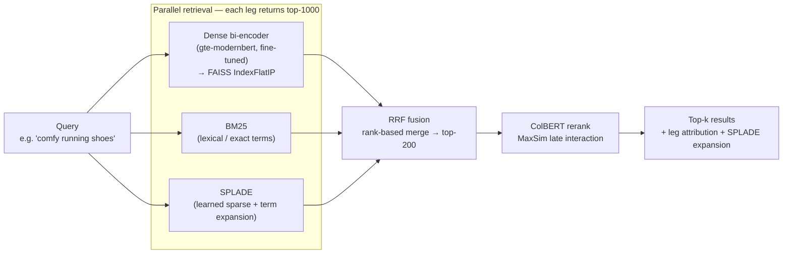
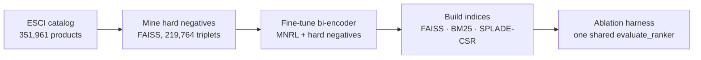

# DANTE — Multi-Stage Hybrid Product Search Engine

DANTE is a production-shaped **hybrid retrieval + reranking** search engine over the Amazon
ESCI shopping-queries catalog (**351,961 products**). It runs three complementary retrievers
in parallel — a **fine-tuned dense bi-encoder**, **BM25** lexical, and **SPLADE** learned-sparse —
fuses them with **Reciprocal Rank Fusion (RRF)**, and reranks the survivors with a **ColBERT
late-interaction** model. Every configuration is measured through one shared eval harness on a
query-disjoint test split, so each stage's contribution is provable, not asserted.

**Headline (v0.2, hard-negative fine-tune):** the dense leg went from **R@200 0.627 → 0.698
(+11%)** and **nDCG@10 0.313 → 0.410** after hard-negative mining on a retrieval-pretrained
backbone; the best serving config (**Dense+SPLADE, RRF k=30**) reaches **R@200 0.729 /
nDCG@10 0.448 / MRR@10 0.682**. A controlled A/B showed the *same* hard negatives **regressed**
a raw-MLM backbone to 0.548 — the central engineering finding below.

---

## Architecture



**Offline training / index pipeline** (feeds the dense leg above):



### Stage by stage

**1. Dense bi-encoder (fine-tuned).** A single-vector encoder maps the query and each product
into the same 768-d space; cosine similarity is relevance. Products are embedded once into a
`faiss.IndexFlatIP` (L2-normalized → inner product = cosine); at query time one encode + one
ANN search returns the top-1000. This leg captures *semantic* matches ("comfy" ≈ "cushioned")
that lexical search misses. It is the only trained component and the focus of v0.2 (below).

**2. BM25 (lexical).** Classic TF-IDF-style term scoring over tokenized product text. It nails
the things dense embeddings blur — exact brand names, model numbers, SKUs, rare tokens. Pure
`rank_bm25`, no training. Cheap to build, and a strong, hard-to-beat baseline on head queries.

**3. SPLADE (learned sparse).** An MLM (`opensearch-neural-sparse-encoding-v2-distill`, Apache-2.0)
projects text onto a ~30K-term vocabulary with learned weights, *including expansion terms not in
the surface text* ("running" also lights up "jog / sprint / athletic"). Stored as a `scipy.sparse`
CSR matrix; search is one sparse matmul. It bridges lexical and semantic — the strongest single
leg in every ablation.

**4. RRF fusion.** The three legs' scores live on incomparable scales (BM25 ∈ [0,30], cosine ∈
[0,1], SPLADE dot ∈ [0,40]), so fusion ignores raw scores and uses only **rank position**:
`RRF(d) = Σ_legs 1/(k + rank_leg(d))`. A product ranked highly by several legs accumulates a high
fused score even if no single leg put it first. Keep the top-200 as the rerank shortlist. `k` is a
tunable knob — swept below.

**5. ColBERT rerank.** A late-interaction model (`answerai-colbert-small-v1`) that keeps a vector
*per token* and scores `MaxSim(Q,D) = Σ_i max_j (q_i · d_j)` — each query token finds its best
matching document token. This is cross-encoder-quality (tokens interact) at bi-encoder-ish cost
(documents are pre-encodable). It runs on the 200 fused candidates only — reranking the full
catalog would be intractable, which is exactly why the fast legs narrow first. It **reorders**,
so it lifts ranking metrics (nDCG/MRR) while recall is unchanged.

---

## Results

Amazon ESCI (US, reduced), query-disjoint split (leakage asserted = 0). Graded qrels
(Exact=3 / Substitute=2 / Complement=1 / Irrelevant=0); recall counts Exact+Substitute as
relevant. v0.1 evaluated on a 2,000-query sample, v0.2 on an 800-query sample — the two are
directly comparable because the **model-independent** rows match across samples (BM25 R@200
0.530→0.517, SPLADE 0.674→0.677). Retriever ceiling (canonical-query self-hit on the full index)
= **rank-1 0.993 / rank-10 0.9995** → the encoder + index are correct, so the numbers are trustworthy.

| Configuration | R@200 (v0.1) | R@200 (v0.2) | nDCG@10 (v0.1) | nDCG@10 (v0.2) |
|---|---|---|---|---|
| BM25 | 0.530 | 0.517 | 0.321 | 0.317 |
| Dense | 0.627 | **0.698** | 0.313 | **0.410** |
| SPLADE | 0.674 | 0.677 | 0.434 | 0.432 |
| Dense + BM25 (RRF) | 0.678 | 0.692 | 0.363 | 0.393 |
| Dense + SPLADE (RRF) | 0.730 | **0.730** | 0.418 | **0.446** |
| Dense + BM25 + SPLADE (RRF) | 0.719 | 0.715 | 0.424 | 0.428 |
| ↑ + ColBERT rerank | 0.719 | 0.715 | **0.448** | 0.446 |
| ↑ + CE rerank (gte-modernbert) | — | 0.715 | — | 0.330 |
| **Dense + SPLADE (RRF k=30)** | — | **0.729** | — | **0.448** |
| Dense + BM25 + SPLADE (weighted RRF) | — | 0.728 | — | 0.445 |

**How to read the numbers.** **R@200** is the recall of the 200-candidate set the reranker
actually sees — the ceiling on final quality, since the reranker can only reorder what fusion
hands it. **nDCG@10** is top-10 ranking quality (are the best answers near the top, in order).
R@10 is low across the board (~0.2–0.28) because each query has many graded-relevant products;
R@200 is the meaningful recall headline.

**What it shows.** (1) **Fusion lifts recall**: best R@200 0.730 (Dense+SPLADE) vs 0.674 for the
best single leg. (2) **The hard-negative fine-tune lifts the weakest leg by a wide margin**:
dense R@200 +11%, nDCG@10 +0.097. (3) **A stronger dense leg does not fold into free fused
recall**: Dense+SPLADE R@200 is flat (0.730→0.730) because SPLADE already covered what the old
dense leg missed — but the *ranking* of that same config improves markedly (nDCG@10 0.418→0.446).
(4) **ColBERT lifts ranking, not recall** (it only reorders the top-200). (5) **RRF k=30 beats the
k=60 default** on ranking at equal recall — measured in both versions.

Full numbers: [`ablation_results.json`](ablation_results.json) (v0.1) and [`eval_enrich.json`](eval_enrich.json)
(dim-truncation + RRF-k sweeps).

---

## Engineering journey — what we tried

This section is the point of the project: the honest path, including the dead ends.

### v0.1 — the baseline that named its own weakness

The first release fine-tuned **`ModernBERT-base`** with in-batch negatives only
(`MultipleNegativesRankingLoss`, bs=128, ~5,700 steps, 3 epochs) and used pretrained SPLADE +
ColBERT. It worked and the fusion story held — but the ablation was blunt about the weak link:
**the dense leg was the worst single retriever** (R@200 0.627, nDCG@10 0.313 — barely above BM25),
while SPLADE led at 0.674. In-batch negatives are "easy" negatives; the model never learned to
push apart genuinely confusable products. The v0.1 write-up explicitly flagged **hard-negative
mining as the #1 next lever**. v0.2 is that lever.

### v0.2 — hard-negative mining

We mined hard negatives from the full 351,961-product catalog with FAISS
(`sentence_transformers.util.mine_hard_negatives`, batched ANN — never the O(Q×N) brute-force
`rank_bm25` loop). Two guards against ESCI's incomplete labels: `range_min=10` (skip ranks 1–9,
where the ~dozen labeled products/query mean the top is full of *unlabeled* relevants) and
`relative_margin=0.05` (a candidate must score below `positive_sim × 0.95` to count as a negative).

- **First attempt used `output_format="n-tuple"`** and dropped **83% of rows** — any anchor that
  couldn't fill all N negative slots was discarded (41,213 of 244,179 survived).
- **Switching to `output_format="triplet"`** (one row per mined negative) kept **219,764 clean
  triplets** — 5.3× more data.

### The key insight — a controlled A/B on the backbone

We trained **two** backbones on the **exact same** hard negatives:

| Backbone | Pretraining | Dense R@200 | vs v0.1 (0.627) |
|---|---|---|---|
| `gte-modernbert-base` | retrieval-pretrained | **0.698** | **+11%** |
| `ModernBERT-base` | raw MLM | 0.548 | **regressed** |

Same data, same recipe, same eval — **opposite outcomes**. Hard negatives only pay off on a
**retrieval-pretrained** backbone. Because ESCI's labels are sparse, mining inevitably scoops up
*unlabeled relevants* (false negatives) and trains the model to push them away. A
retrieval-pretrained backbone has enough prior structure to survive that noise and still net a
gain; a raw-MLM backbone gets **poisoned** by it and degrades below the in-batch baseline. The
comparison was clean: the model-independent BM25/SPLADE rows matched across query samples, so the
delta is attributable to the backbone alone. v0.2 ships `gte-modernbert-base + HN` and keeps the
ModernBERT-HN run in the repo as the documented control.

### The undertraining red herring

Before that clean comparison, a first retrain used **`CachedMultipleNegativesRankingLoss` at
effective batch 2048** (mini-batch 256, GradCache) — the "more in-batch negatives = better MNRL"
lever. It **regressed** the dense leg. Root cause was not the loss but the **step count**: bs=2048
over 2 epochs is only **~216 optimizer steps** (vs v0.1's ~5,700 at bs=128) with an unscaled
learning rate — badly undertrained. The fix was to return to v0.1's proven recipe *plus* the hard
negatives: **bs=128, 3 epochs, ~5,151 steps, plain MNRL + `BatchSamplers.NO_DUPLICATES`** (triplet
data repeats an anchor across its negatives; without NO_DUPLICATES two such rows can co-occur in a
batch and MNRL pushes an anchor off its *own* positive). Big-batch CachedMNRL is deferred until
its epoch/LR schedule is tuned — reporting it as-is would have been an unfair comparison.

### Best serving config

**Dense+SPLADE with RRF k=30** — R@200 0.729, nDCG@10 0.4483, MRR@10 0.682. Adding BM25 as a
third leg slightly *hurt* (it injects lexical noise the other two already cover); down-weighting
BM25 to 0.5 in a weighted RRF recovers most of it (0.728 / 0.445) but doesn't beat the two-leg
config. And **k ≤ 30 beats k=60 on ranking at equal recall** — confirmed in both v0.1 and v0.2 RRF
sweeps. The cross-encoder rerank row (`gte-modernbert` CE, nDCG@10 0.330) *underperformed the
fusion it reranked* — a pretrained-not-fine-tuned CE is the wrong tool at this recall depth — so
ColBERT stays the reranker of record.

### Ablation-harness hardening (production-ML infra)

The winner-selection sweep survived **six** distinct failure modes, each root-caused rather than
worked around:

1. **A 2B `bge-reranker-v2-gemma` row** made a single sweep take *hours* → dropped from the
   default sweep (kept as an opt-in small-sample row).
2. **`run_all_ablations` recomputed every retrieval leg per config** — the pure-Python BM25 leg
   over ~350K docs ran ~11× → added a **per-query leg cache** (retrieve each leg once, reuse across
   all fusion/rerank configs). Minutes instead of ~1.5h; results bit-identical.
3. **`bge-reranker-v2-m3` hung 20+ min** inside the `rerankers` library (XLM-R-large loader falls
   back to unbatched CPU) → dropped, with a note to re-enable once the loader is fixed.
4. **Results were only written at the very end**, so a slow/hung later config hid *everything*
   before it → added **per-config metric prints + incremental partial-JSON** so the Dense R@200
   winner number can never be lost.
5. **Modal's preemptible A100 pool killed jobs** ("worker preemption") → broad-pattern detection +
   fresh-relaunch (every stage is idempotent and checkpoints to the volume).
6. **The undertraining above** — caught precisely *because* the harness surfaced per-config numbers
   and the clean model-independent control rows.

### Deferred / future work

- `bge-reranker-v2-gemma` (2B) at a small query count — max-accuracy rerank row.
- `bge-reranker-v2-m3` — fix the `rerankers` loader, then re-enable the CE row.
- Big-batch CachedMNRL with a tuned epoch/LR schedule (the deferred red-herring, done right).
- Round-2 ANCE: re-mine hard negatives with the v0.2 winner and retrain (sharper negatives).
- MatryoshkaLoss training for genuinely cheap low-dim serving (naive truncation costs ~8% nDCG@10
  at 256-d, ~18% at 128-d — measured; not free).

---

## How to run

The only GPU job is the bi-encoder fine-tune. It is fully isolated on Modal — its own app
(`dante-train`) and volume (`dante-artifacts`), **no secrets, no database, no shared state**.
SPLADE and ColBERT use pretrained checkpoints (0h GPU). Artifacts (prepared data, model weights,
indices, ablation JSON) all live on the `dante-artifacts` volume.

```bash
pip install modal && modal token new          # one-time auth

# --- v0.1 baseline ---
modal run modal_train.py --stage data                          # leakage-free train/eval data
modal run modal_train.py --stage all --limit 5000 --epochs 1   # quick smoke test
modal run modal_train.py --stage all                            # full run (~1-1.5h A100)

# --- v0.2 hard-negative flow (defaults keep v0.1 reproducible) ---
modal run modal_train.py --stage mine                                          # 219,764 triplets → data/train_hn
modal run modal_train.py --stage train --train-dir data/train_hn \
    --output-name biencoder_v2 --base-model Alibaba-NLP/gte-modernbert-base
modal run modal_train.py --stage index    --model-dir biencoder_v2 --index-dir index_v2
modal run modal_train.py --stage preflight --model-dir biencoder_v2 --index-dir index_v2
modal run modal_train.py --stage ablation --model-dir biencoder_v2 --index-dir index_v2 \
    --results-name ablation_results_v2.json
```

Stages: `data` → `mine` → `train` → `index` → `preflight` → `ablation` (+ `eval_enrich` for the
dim-truncation and RRF-k sweeps). Every stage is idempotent and writes to the volume, so the
universal recovery from a preemption is "re-run that `--stage`." Pull the trained model with
`modal volume get dante-artifacts /biencoder_v2 ./models/dante_biencoder`.

Install the package (public API in `dante/__init__.py`: `DanteSearchEngine`, `train_biencoder`,
`SpladeEncoder`, `BM25Index`, `colbert_rerank`, `reciprocal_rank_fusion`):

```bash
pip install git+https://github.com/DestroyorahSignus/dante.git
```

### Stack (pinned)

`transformers==4.57.6`, `sentence-transformers==4.1.0`, `rerankers==0.10.0`, `faiss-cpu`,
`rank-bm25`, `scipy`. **The pin matters:** `transformers` 5.x removed internals
(`generate_model_card`, `all_tied_weights_keys`) that the ColBERT reranker depends on — on 5.x it
silently no-ops. Everything adopted fits under the 4.57.6 pin.

---

## Limitations / notes

- **Relevance-only labels.** ESCI has no ratings, sales, or click signal — only human E/S/C/I
  relevance grades. A real store would blend behavioral signals into ranking.
- **Sparse labels inflate the difficulty of recall metrics** and are the root cause of the
  hard-negative false-negative problem — the central v0.2 finding.
- **The dense leg is still the weakest single leg** even after the fine-tune; SPLADE leads. Round-2
  re-mining is the next lever.
- **Serving.** The demo/eval uses in-memory FAISS + a CSR SPLADE matrix; a production deployment
  would self-host FAISS (or a vector DB) and an inverted-index SPLADE service, with the three legs
  behind concurrent calls.

---

## Dataset

Amazon ESCI (Shopping Queries), reduced US split. Full prepared corpus: **train 244,179 pairs ·
val 2,508 · catalog 351,961 products · 2,150 test queries · 43,151 graded judgements · leakage 0
(asserted)**. Split is **by query** (deterministic `hash(query_id) % 10`), never by pair, so no
query appears in both splits. Product text = `title [SEP] brand [SEP] bullet[:256] [SEP]
description[:256]`.
